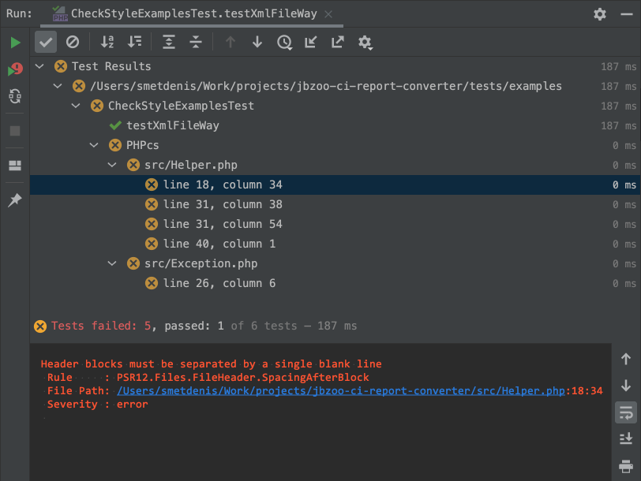
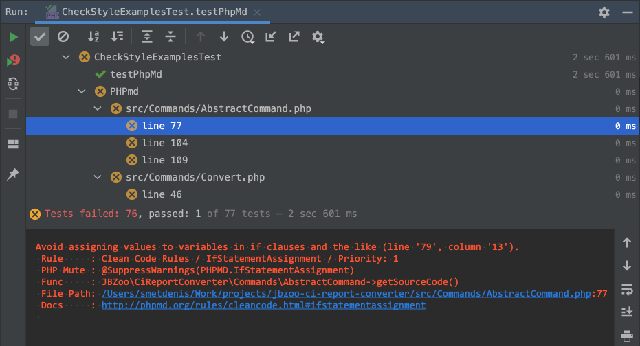
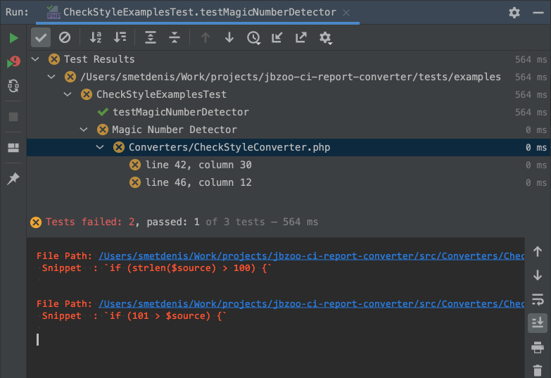
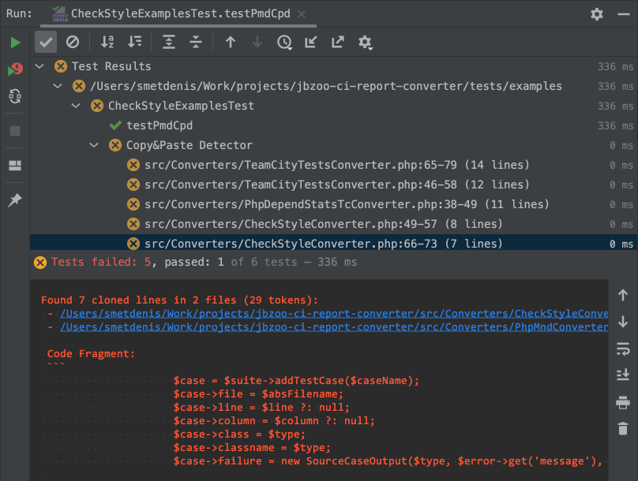
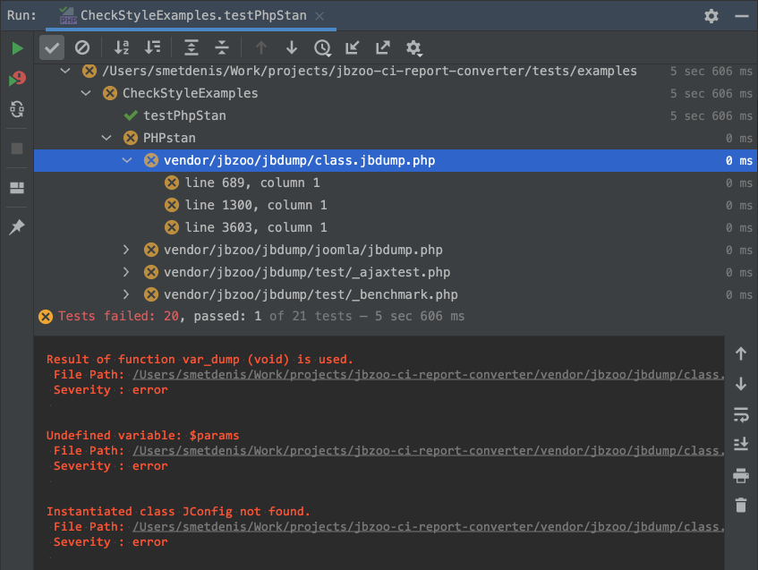
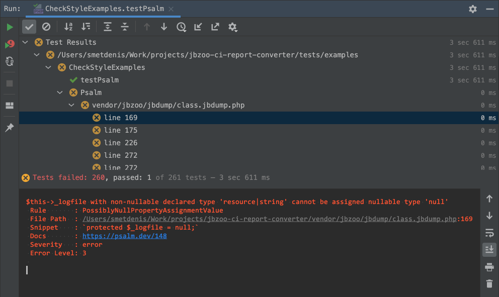
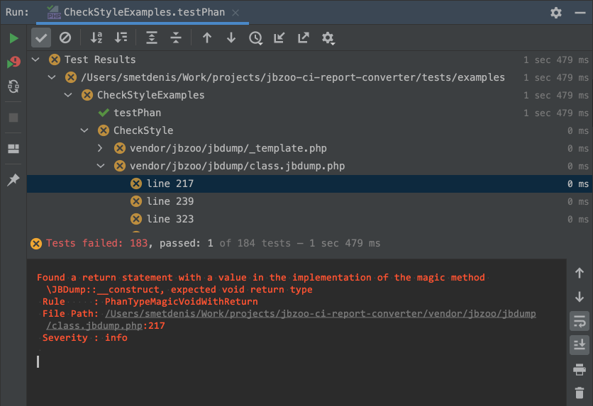

# JBZoo / CI-Report-Converter

[](https://travis-ci.org/JBZoo/CI-Report-Converter)    [](https://github.com/JBZoo/CI-Report-Converter/actions/workflows/main.yml)    [](https://hub.docker.com/r/jbzoo/ci-report-converter)    [](https://codecov.io/gh/JBZoo/CI-Report-Converter)    [](https://shepherd.dev/github/JBZoo/CI-Report-Converter)    [](https://scrutinizer-ci.com/g/jbzoo/ci-report-converter/?branch=master)    
[](https://github.com/JBZoo/CI-Report-Converter/blob/master/composer.json)    [](https://www.php.net/manual/en/language.types.declarations.php#language.types.declarations.strict)    [](https://packagist.org/packages/jbzoo/ci-report-converter)    [](https://packagist.org/packages/jbzoo/ci-report-converter/stats)    [](https://hub.docker.com/r/jbzoo/ci-report-converter)    [](https://github.com/JBZoo/CI-Report-Converter/issues)    [](https://github.com/JBZoo/CI-Report-Converter/blob/master/LICENSE)


<!-- START doctoc generated TOC please keep comment here to allow auto update -->
<!-- DON'T EDIT THIS SECTION, INSTEAD RE-RUN doctoc TO UPDATE -->

- [Why?](#why)
- [Installing](#installing)
- [Using as GitHub Action](#using-as-github-action)
- [Available Directions](#available-directions)
- [Help description in terminal](#help-description-in-terminal)
  - [Converting](#converting)
  - [Custom Metrics in TeamCity](#custom-metrics-in-teamcity)
- [Examples](#examples)
  - [JetBrains IDE (IntelliJ IDEA, PhpStorm, WebStorm, etc)](#jetbrains-ide-intellij-idea-phpstorm-webstorm-etc)
    - [Mess Detector (phpmd-json)](#mess-detector-phpmd-json)
    - [Magic Number Detector (phpmnd)](#magic-number-detector-phpmnd)
    - [Copy/Paste Detector (pmd-cpd)](#copypaste-detector-pmd-cpd)
    - [PHPStan (checkstyle)](#phpstan-checkstyle)
    - [Psalm (psalm-json)](#psalm-psalm-json)
    - [Phan (checkstyle)](#phan-checkstyle)
  - [TeamCity](#teamcity)
    - [As Failed Unit test](#as-failed-unit-test)
    - [As Code Inspections](#as-code-inspections)
    - [As Custom Metrics](#as-custom-metrics)
  - [GitHub Actions](#github-actions)
  - [GitLab CI](#gitlab-ci)
- [Contributing](#contributing)
- [License](#license)

<!-- END doctoc generated TOC please keep comment here to allow auto update -->

## Why?

I believe you are familiar with the huge zoo of various utilities for testing, checking code standards, linters etc. 
It's really often the output of utilities is not supported in popular CI systems (TeamCity, GitHub, etc...).
I guess you are lucky if the utility saves the error report in the `junit.xml` format, because it works pretty fine with almost all modern dev software.

But... My experience tells me it's the exception rather than the rule.
For example, I really like the good old [phpmd](https://github.com/phpmd/phpmd) utility (perhaps you have another _right_ opinion about the benefits. At least, it's just an example).
It doesn't integrate well with TeamCity/PhpStorm/GitHub. Everytime I spend a lot of time looking for results in the logs. But I really want to see error reporting instantly and pretty printed.

Therefore, I developed a converter that changes the report format for deep integration with CI systems and JetBrain IDEs.

Well... It may seem to you it's a useless thing, and _your favorite super tool_ works fine in TeamCity/PhpStorm. Just take a look at [the examples below](#examples).


## Installing

```shell
composer require jbzoo/ci-report-converter
php ./vendor/bin/ci-report-converter --help

# OR use phar file
wget https://github.com/JBZoo/CI-Report-Converter/releases/latest/download/ci-report-converter.phar
chmod +x ./ci-report-converter.phar
./ci-report-converter.phar --help

# OR just pull the Docker Image
docker run --rm jbzoo/ci-report-converter --help 
```


## Using as GitHub Action

Action allows you to convert error reports to the [GitHub Annotations format](https://docs.github.com/en/actions/reference/workflow-commands-for-github-actions#setting-a-warning-message)
 * See [demo of error output](https://github.com/JBZoo/CI-Report-Converter/actions/workflows/gh-action.yml?query=is%3Asuccess)
 * To learn more [see different examples](.github/workflows/gh-action.yml)

```yaml
- uses: jbzoo/ci-report-converter@master # or see the specific version on releases page
  with:
    # File path with the original report format. If not set or empty, then the STDIN is used.
    # Required: true
    input-file: ./build/checkstyle.xml

    # Source format. Available options: checkstyle, junit, phpmd-json, phpmnd, pmd-cpd, psalm-json
    # Default value: checkstyle
    # Required: true
    input-format: checkstyle

    # File path with the result report format. If not set or empty, then the STDOUT is used.
    output-file: ./build/junit.xml

    # Target format. Available options: gitlab-json, github-cli, junit, tc-inspections, tc-tests
    # Default value: github-cli
    # Required: true
    output-format: junit

    # Set custom name of root group/suite
    # Required: true
    suite-name: My Tests

```


## Available Directions

<p align="center"><!-- Auto-created image via JBZoo\PHPUnit\CiReportConverterReadmeTest__testBuildGraphManually -->
  
</p>


At the moment, converting of reports works with
  * Input Formats:
    * [checkstyle](tests/fixtures/origin/phpcs/codestyle.xml) - the most popular sort of error report. It works for [Phan](https://github.com/phan/phan), [PHPcs](https://github.com/squizlabs/PHP_CodeSniffer) and others.
    * [junit](tests/fixtures/origin/phpunit/junit-simple.xml) - also it's really popular sort of error report. Usually, the format is used to display unit test results.
    * [phpmd-json](tests/fixtures/origin/phpmd/json.json) - the most detailed report of [PHPMD](https://github.com/phpmd/phpmd).
    * [phpmnd](tests/fixtures/origin/phpmnd/phpmnd.xml) - I know only [PHP Magic Numbers Detector](https://github.com/povils/phpmnd).
    * [psalm-json](tests/fixtures/origin/psalm/json.json) - the most detailed report of [Psalm](https://github.com/vimeo/psalm).
    * [pmd-cpd](tests/fixtures/origin/phpcpd/pmd-cpd.xml) - it's PMD-CPD XML format. An example of tool is [Copy/Paste Detector](https://github.com/sebastianbergmann/phpcpd).
  * Output Formats:
    * [gitlab-json](tests/fixtures/origin/phpstan/gitlab.json) - [GitLab Custom Report](https://docs.gitlab.com/ee/user/project/merge_requests/code_quality.html#implementing-a-custom-tool).
    * [junit](tests/fixtures/origin/phpunit/junit-simple.xml) - The most popular sort of reporting.
    * [tc-tests](tests/fixtures/test-cases/ConverterTeamCityTest) - [Reporting Tests in TeamCity/PhpStorm/JetBrains](https://www.jetbrains.com/help/teamcity/service-messages.html#Reporting+Tests).
    * [tc-inspections](tests/fixtures/test-cases/ConverterTeamCityInspectionsTest) - [Reporting Inspections in TeamCity](https://www.jetbrains.com/help/teamcity/service-messages.html#Reporting+Inspections).


Also, you can follow [metrics around your code in TeamCity](https://www.jetbrains.com/help/teamcity/service-messages.html#Reporting+Build+Statistics) via `teamcity:stats`
 * [JUnit.xml](tests/fixtures/origin/phpunit/junit-nested.xml) => [Example in TeamCity](tests/fixtures/test-cases/ConverterTeamCityStatsTest/testJUnitXml.txt)
 * [PHPUnitClover.xml](tests/fixtures/origin/phpunit/clover.xml) => [Example in TeamCity](tests/fixtures/test-cases/ConverterTeamCityStatsTest/testPhpUnitCloverXml.txt)
 * [PHPDepend.xml](tests/fixtures/origin/pdepend/pdepend-old.xml) => [Example in TeamCity](tests/fixtures/test-cases/ConverterTeamCityStatsTest/testPhpDependXml.txt)
 * [PHPloc.json](tests/fixtures/origin/phploc/json.json) => [Example in TeamCity](tests/fixtures/test-cases/ConverterTeamCityStatsTest/testPhpLocJson.txt)
 * [PHPMetrics.xml](tests/fixtures/origin/phpmetrics/phpmetrics.xml) => [Example in TeamCity](tests/fixtures/test-cases/ConverterTeamCityStatsTest/testPhpMetricsXml.txt)


## Help description in terminal

### Converting

**NOTE:** The action `convert` is marked as default.
So `./ci-report-converter.phar convert` is absolutely the same as `./ci-report-converter.phar`.

```
$ php ./vendor/bin/ci-report-converter convert --help
Description:
  Convert one report format to another one

Usage:
  convert [options]

Options:
  -S, --input-format=INPUT-FORMAT    Source format. Available options: checkstyle, junit, phpmd-json, phpmnd, pmd-cpd, psalm-json [default: "checkstyle"]
  -T, --output-format=OUTPUT-FORMAT  Target format. Available options: gitlab-json, github-cli, junit, tc-inspections, tc-tests [default: "tc-tests"]
  -N, --suite-name=SUITE-NAME        Set custom name of root group/suite
  -I, --input-file[=INPUT-FILE]      File path with the original report format. If not set or empty, then the STDIN is used.
  -O, --output-file[=OUTPUT-FILE]    File path with the result report format. If not set or empty, then the STDOUT is used.
  -R, --root-path[=ROOT-PATH]        If option is set, all absolute file paths will be converted to relative once. [default: "."]
  -F, --tc-flow-id[=TC-FLOW-ID]      Custom flowId for TeamCity output
  -h, --help                         Display this help message
  -q, --quiet                        Do not output any message
  -V, --version                      Display this application version
      --ansi                         Force ANSI output
      --no-ansi                      Disable ANSI output
  -n, --no-interaction               Do not ask any interactive question
  -v|vv|vvv, --verbose               Increase the verbosity of messages: 1 for normal output, 2 for more verbose output and 3 for debug

```


### Custom Metrics in TeamCity

To clarify the use of the method, take a look at the [examples and screenshots](#as-code-inspections), please.

```
$ php ./vendor/bin/ci-report-converter teamcity:stats --help
Description:
  Push code metrics to TeamCity Stats

Usage:
  teamcity:stats [options]

Options:
  -S, --input-format=INPUT-FORMAT  Source format. Available options: junit-xml, pdepend-xml, phploc-json, phpmetrics-xml, phpunit-clover-xml
  -I, --input-file[=INPUT-FILE]    File path with the original report format. If not set or empty, then the STDIN is used.
  -O, --output-file[=OUTPUT-FILE]  File path with the result report format. If not set or empty, then the STDOUT is used.
  -R, --root-path[=ROOT-PATH]      If option is set, all absolute file paths will be converted to relative once. [default: "."]
  -F, --tc-flow-id[=TC-FLOW-ID]    Custom flowId for TeamCity output
  -h, --help                       Display this help message
  -q, --quiet                      Do not output any message
  -V, --version                    Display this application version
      --ansi                       Force ANSI output
      --no-ansi                    Disable ANSI output
  -n, --no-interaction             Do not ask any interactive question
  -v|vv|vvv, --verbose             Increase the verbosity of messages: 1 for normal output, 2 for more verbose output and 3 for debug

```


## Examples

### JetBrains IDE (IntelliJ IDEA, PhpStorm, WebStorm, etc)

One of the unique features of the tool is converting reports to a unit test format compatible with JetBrains IDE and TeamCity.
The following examples show how to use JetBrains IDE UI to display any kind of stylish issues.
Yeah, I know that the integration is not the cleanest, and it's not super beautiful. However, this code/screenshots demonstrate the usability of the approach.

**NOTE:** I believe that coding style issues have the same level of severity as any other sort of errors.
Therefore, I prefer to use the same workflow to check the quality of the code as I have with regular PHPUnit tests.
This is the smartest thing for navigating the project and gives the most detailed information about errors.

The general idea is pretty simple: 
 - We take almost any utility for testing. 
 - It saves report in the file or outputs error to StdOut as xml/json.
 - CI-Report-Converter changes the report format. It saves result somewhere or just outputs it in StdOut.
 - ???
 - Profit.

In the next case, we will see how to integrate JetBrains UI with Code Sniffer deeply. I use PHPcs just as example. This is the most popular linter in PHP.
However, the approach is independent of the programming language or unit testing framework.

**NOTE:** Here's an example based on PHPUnit and PhpStorm, but you are not limited to PHP language. This is just an example to show the idea.
So you can use any sort language to integrate style tests with JetBrains IDE.

```php
<?php declare(strict_types=1);

use PHPUnit\Framework\Assert;
use PHPUnit\Framework\TestCase;

class CheckStyleExamplesTest extends TestCase
{
    /**
     * The short example which uses pipe as way to pass error report.
     */
    public function testPipelineWay(): void
    {
        echo shell_exec(                       # Execute command via shell and return the complete output as a string.
            'php ./vendor/bin/phpcs' .         # Path to bin of third-party tool (PHP Code Sniffer is just example).
            ' --report=checkstyle' .           # Output format of PHPcs. ci-report-converter expects it by default as `--input-format` option.
            ' --standard=PSR12 -q ./src' .     # The custom tool options. For phpcs `-q` is important!
            ' | ' .                            # The pipe operator, it passes the output of one command as input to another. See https://en.wikipedia.org/wiki/Pipeline_(Unix)
            ' php ./ci-report-converter.phar'  # The converter does all the magic. Look at help description ( --help) to lean more about options and default values.
        );

        # Usually PHPUnit expects at least one assert in a test.
        # Otherwise, it may show useless warning messages. It depends on PHPUnit version and your configurations.
        # So, just in case, we make a fake assertion.
        Assert::assertTrue(true);
    }

    /**
     * The super detailed example which uses files as way to pass error report.
     */
    public function testXmlFileWay(): void
    {
        shell_exec(                                     # Execute command via shell and return the complete output as a string.
            'php ./vendor/bin/phpcs' .                  # Path to bin of third-party tool (PHP Code Sniffer is just example).
            ' --report=checkstyle' .                    # Output format of PHPcs. CI-Report-Converter expects it by default as `--input-format` option.
            ' --report-file=./build/phpcs-report.xml' . # Save result of phpcs work in XML file in "checkstyle" format.
            ' --standard=PSR12 -q ./src' .              # The custom tool options. For phpcs `-q` is important!
            ' || true > /dev/null'                      # We don't expect any output of phpcs and ignore error exit codes.
                                                        # Lol, we are very self-confident. Actually, we need only XML file, that's it.
        );

        // I've shown all the options explicitly just to add transparency.
        // In fact, this example does the same thing as the code above in `testPipelineWay()`.
        echo shell_exec(
            'php ./ci-report-converter.phar' .          # The path to bin file of CI-Report-Converter. It depends of your installation way. See above.
            ' --input-format=checkstyle' .              # Source reporting format. Default value is "checkstyle".
            ' --input-file=./build/phpcs-report.xml' .  # Using prepared file on previous step as source.
            ' --output-format=tc-tests' .               # Target reporting format. Default value is "tc-tests".
            ' --suite-name=PHPcs' .                     # Define the name of group. See screenshot below.
            ' --root-path=`pwd`'                        # Specify the project path for pretty printing paths in UI. Default value is `.` (current dir). 
        );

        # The same reason like in `testPipelineWay()`.
        Assert::assertTrue(true);
    }
}
```


```shell
# See what happens under the hood. 
cd  ~/your/project/root/directory
php ./vendor/bin/phpunit ./tests/examples/CheckStyleExamples.php --teamcity
```

In both cases you will have the same output in your PhpStorm.




#### Mess Detector (phpmd-json)

<details>
  <summary>Screenshot</summary>

  
  
</details>

```shell
php ./vendor/bin/phpmd ./src json cleancode,codesize,controversial,design,naming,unusedcode | ./ci-report-converter.phar -S phpmd-json
```


#### Magic Number Detector (phpmnd)

<details>
  <summary>Screenshot</summary>

  
  
</details>

```shell
php ./vendor/bin/phpmnd ./src --hint --quiet --xml-output=./build/phpmnd-report.xml
./ci-report-converter.phar --root-path=./src --input-file=./build/phpmnd-report.xml --input-format=phpmnd 
```


#### Copy/Paste Detector (pmd-cpd)

<details>
  <summary>Screenshot</summary>

  
  
</details>

```shell
php ./vendor/bin/phpcpd ./src --log-pmd=./build/phpcpd-report.xml
./ci-report-converter.phar --input-file=./build/phpcpd-report.xml --input-format=pmd-cpd
```


#### PHPStan (checkstyle)

<details>
  <summary>Screenshot</summary>

  
  
</details>

```shell
php ./vendor/bin/phpstan analyse --error-format=checkstyle --no-progress ./src | ./ci-report-converter.phar
```


#### Psalm (psalm-json)

<details>
  <summary>Screenshot</summary>

  
  
</details>

```shell
php ./vendor/bin/psalm --output-format=json | ./ci-report-converter.phar --input-format="psalm-json"
```


#### Phan (checkstyle)

<details>
  <summary>Screenshot</summary>

  
  
</details>

```shell
php ./vendor/bin/phan.phar --allow-polyfill-parser --directory=./src --output-mode=checkstyle |  ./ci-report-converter.phar
```

### TeamCity
#### As Failed Unit test
#### As Code Inspections
#### As Custom Metrics


### GitHub Actions

### GitLab CI


## Contributing

```shell
# Clone the repo and build project
make build

# Make your local changes

# Run all tests and check code style
make test
make codestyle
```


## License

MIT
