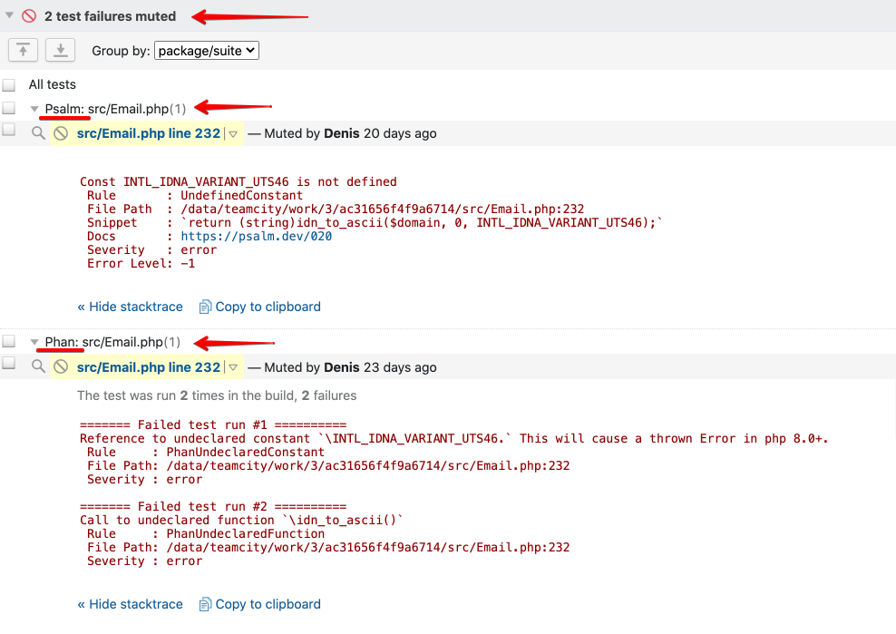
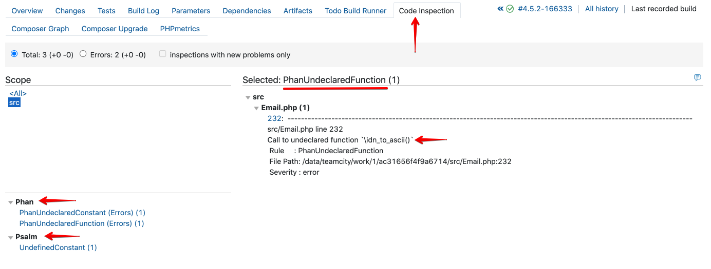

# JBZoo / CI-Report-Converter

[](https://github.com/JBZoo/CI-Report-Converter/actions/workflows/main.yml?query=branch%3Amaster)    [](https://coveralls.io/github/JBZoo/CI-Report-Converter?branch=master)    [](https://shepherd.dev/github/JBZoo/CI-Report-Converter)    [](https://shepherd.dev/github/JBZoo/CI-Report-Converter)    [](https://www.codefactor.io/repository/github/jbzoo/ci-report-converter/issues)    
[](https://packagist.org/packages/jbzoo/ci-report-converter/)    [](https://packagist.org/packages/jbzoo/ci-report-converter/stats)    [](https://packagist.org/packages/jbzoo/ci-report-converter/dependents?order_by=downloads)    []()    [](https://github.com/JBZoo/CI-Report-Converter/blob/master/LICENSE)


<!-- START doctoc generated TOC please keep comment here to allow auto update -->
<!-- DON'T EDIT THIS SECTION, INSTEAD RE-RUN doctoc TO UPDATE -->

- [Why?](#why)
- [Installing](#installing)
- [Using as GitHub Action](#using-as-github-action)
  - [Example GitHub Action workflow](#example-github-action-workflow)
- [Available Directions](#available-directions)
- [Help description in terminal](#help-description-in-terminal)
  - [Converting](#converting)
  - [Custom Metrics in TeamCity](#custom-metrics-in-teamcity)
- [Examples](#examples)
  - [JetBrains IDE (IntelliJ IDEA, PhpStorm, WebStorm, etc)](#jetbrains-ide-intellij-idea-phpstorm-webstorm-etc)
    - [Mess Detector (phpmd-json)](#mess-detector-phpmd-json)
    - [Magic Number Detector (phpmnd)](#magic-number-detector-phpmnd)
    - [Copy/Paste Detector (pmd-cpd)](#copypaste-detector-pmd-cpd)
    - [PHPStan (checkstyle)](#phpstan-checkstyle)
    - [Psalm (psalm-json)](#psalm-psalm-json)
    - [Phan (checkstyle)](#phan-checkstyle)
  - [TeamCity - Style Issue As Failed Unit test](#teamcity---style-issue-as-failed-unit-test)
  - [TeamCity - Style Issue As Code Inspections](#teamcity---style-issue-as-code-inspections)
  - [TeamCity - Reported Statistic Values](#teamcity---reported-statistic-values)
  - [GitHub Actions](#github-actions)
  - [GitLab CI](#gitlab-ci)
  - [Use tool as SDK to generate reports](#use-tool-as-sdk-to-generate-reports)
    - [JUnit.xml (API)](#junitxml-api)
    - [GitHub Actions (API)](#github-actions-api)
- [Contributing](#contributing)
- [License](#license)
- [See Also](#see-also)

<!-- END doctoc generated TOC please keep comment here to allow auto update -->

## Why?

I believe you are familiar with the huge zoo of various utilities for testing, checking code standards, linters etc. 
It's really often the output of utilities is not supported in popular CI systems (TeamCity, GitHub, etc...).
I guess you are lucky if the utility saves the error report in the `junit.xml` format, because it works pretty fine with almost all modern dev software.

But... My experience tells me it's the exception rather than the rule.
For example, I really like the good old [phpmd](https://github.com/phpmd/phpmd) utility (perhaps you have another _right_ opinion about the benefits. At least, it's just an example).
It doesn't integrate well with TeamCity/PhpStorm/GitHub. Everytime I spend a lot of time looking for results in the logs. Though I really want to see instant and well-printed error report.

Therefore, I developed a converter that changes the report format for deep integration with CI systems and JetBrain IDEs.

Well... It may seem to you it's a useless thing, and _your favorite super tool_ works fine in TeamCity/PhpStorm. Just take a look at [the examples below](#examples).


## Installing

```shell
composer require jbzoo/ci-report-converter
php ./vendor/bin/ci-report-converter --help

# OR use phar file
wget https://github.com/JBZoo/CI-Report-Converter/releases/latest/download/ci-report-converter.phar
chmod +x ./ci-report-converter.phar
./ci-report-converter.phar --help

# OR just pull the Docker Image
docker run --rm jbzoo/ci-report-converter --help 
```


## Using as GitHub Action

Action allows you to convert error reports to the [GitHub Annotations format](https://docs.github.com/en/actions/reference/workflow-commands-for-github-actions#setting-a-warning-message)
 * See [demo of error output](https://github.com/JBZoo/CI-Report-Converter/actions/workflows/gh-action.yml?query=is%3Asuccess)
 * To learn more [see different examples](.github/workflows/gh-action.yml)

```yaml
- uses: jbzoo/ci-report-converter@master # or see the specific version on releases page
  with:
    # File path with the original report format. If not set or empty, then the STDIN is used.
    # Required: true
    input-file: ./build/checkstyle.xml

    # Source format. Available options: checkstyle, junit, phpmd-json, phpmnd, pmd-cpd, psalm-json
    # Default value: checkstyle
    # Required: true
    input-format: checkstyle

    # Will exit with the code=1, if any violations are found.
    # Default value: no
    non-zero-code: yes

    # File path with the result report format. If not set or empty, then the STDOUT is used.
    output-file: ./build/junit.xml

    # Target format. Available options: gitlab-json, github-cli, junit, plain, tc-inspections, tc-tests
    # Default value: github-cli
    # Required: true
    output-format: junit

    # Set custom name of root group/suite (if it's possible).
    # Required: true
    suite-name: My Tests

```

### Example GitHub Action workflow
```yml
name: Linters

on:
  pull_request:
    branches:
      - "*"

jobs:
  linters:
    name: PHPcs
    runs-on: ubuntu-latest
    steps:
      - name: Checkout Code
        uses: actions/checkout@v2
        
      - name: PHP Code Sniffer
        run: ./vendor/bin/phpcs --report=checkstyle --standard=PSR12 -q ./src > ./build/phpcs-checkstyle.xml
        
      - name: Converting checkstyle.xml to Github Annotations
        uses: jbzoo/ci-report-converter@master
        with:
          input-file: build/phpcs-checkstyle.xml

```


## Available Directions


At the moment, converting of reports works with
  * Input Formats:
    * [checkstyle](tests/fixtures/origin/phpcs/codestyle.xml) - the most popular sort of error report. It works for [Phan](https://github.com/phan/phan), [PHPcs](https://github.com/squizlabs/PHP_CodeSniffer) and others.
    * [junit](tests/fixtures/origin/phpunit/junit-simple.xml) - also it's really popular sort of error report. Usually, the format is used to display unit test results.
    * [phpmd-json](tests/fixtures/origin/phpmd/json.json) - the most detailed report of [PHPMD](https://github.com/phpmd/phpmd).
    * [phpmnd](tests/fixtures/origin/phpmnd/phpmnd.xml) - I know only [PHP Magic Numbers Detector](https://github.com/povils/phpmnd).
    * [psalm-json](tests/fixtures/origin/psalm/json.json) - the most detailed report of [Psalm](https://github.com/vimeo/psalm).
    * [pmd-cpd](tests/fixtures/origin/phpcpd/pmd-cpd.xml) - it's PMD-CPD XML format. An example of tool is [Copy/Paste Detector](https://github.com/sebastianbergmann/phpcpd).
  * Output Formats:
    * [gitlab-json](tests/fixtures/origin/phpstan/gitlab.json) - [GitLab Custom Report](https://docs.gitlab.com/ee/user/project/merge_requests/code_quality.html#implementing-a-custom-tool).
    * [junit](tests/fixtures/origin/phpunit/junit-simple.xml) - The most popular sort of reporting.
    * [tc-tests](tests/fixtures/test-cases/ConverterTeamCityTest/testJUnit.txt) - [Reporting Tests in TeamCity/PhpStorm/JetBrains](https://www.jetbrains.com/help/teamcity/service-messages.html#Reporting+Tests).
    * [tc-inspections](tests/fixtures/test-cases/ConverterTeamCityInspectionsTest) - [Reporting Inspections in TeamCity](https://www.jetbrains.com/help/teamcity/service-messages.html#Reporting+Inspections).


Also, you can follow [metrics around your code in TeamCity](https://www.jetbrains.com/help/teamcity/service-messages.html#Reporting+Build+Statistics) via `teamcity:stats`
 * [JUnit.xml](tests/fixtures/origin/phpunit/junit-nested.xml) => [Example in TeamCity](tests/fixtures/test-cases/ConverterTeamCityStatsTest/testJUnitXml.txt)
 * [PHPUnitClover.xml](tests/fixtures/origin/phpunit/clover.xml) => [Example in TeamCity](tests/fixtures/test-cases/ConverterTeamCityStatsTest/testPhpUnitCloverXml.txt)
 * [PHPDepend.xml](tests/fixtures/origin/pdepend/pdepend-old.xml) => [Example in TeamCity](tests/fixtures/test-cases/ConverterTeamCityStatsTest/testPhpDependXml.txt)
 * [PHPloc.json](tests/fixtures/origin/phploc/json.json) => [Example in TeamCity](tests/fixtures/test-cases/ConverterTeamCityStatsTest/testPhpLocJson.txt)
 * [PHPMetrics.xml](tests/fixtures/origin/phpmetrics/phpmetrics.xml) => [Example in TeamCity](tests/fixtures/test-cases/ConverterTeamCityStatsTest/testPhpMetricsXml.txt)


## Help description in terminal

### Converting

```
$ php ./vendor/bin/ci-report-converter convert --help
Description:
  Convert one report format to another one

Usage:
  convert [options]

Options:
  -S, --input-format=INPUT-FORMAT      Source format. Available options: checkstyle, junit, phpmd-json, phpmnd, pmd-cpd, psalm-json [default: "checkstyle"]
  -I, --input-file[=INPUT-FILE]        File path with the original report format. If not set or empty, then the STDIN is used.
  -T, --output-format=OUTPUT-FORMAT    Target format. Available options: gitlab-json, github-cli, junit, plain, tc-inspections, tc-tests [default: "tc-tests"]
  -O, --output-file[=OUTPUT-FILE]      File path with the result report format. If not set or empty, then the STDOUT is used.
  -R, --root-path[=ROOT-PATH]          If option is set, all absolute file paths will be converted to relative once. [default: "."]
  -N, --suite-name=SUITE-NAME          Set custom name of root group/suite (if it's possible).
  -F, --tc-flow-id[=TC-FLOW-ID]        Custom flowId in TeamCity output. Default value is PID of the tool.
  -Q, --non-zero-code[=NON-ZERO-CODE]  Will exit with the code=1, if any violations are found. [default: "no"]
      --no-progress                    Disable progress bar animation for logs
      --mute-errors                    Mute any sort of errors. So exit code will be always "0" (if it's possible).
                                       It has major priority then --non-zero-on-error. It's on your own risk!
      --stdout-only                    For any errors messages application will use StdOut instead of StdErr. It's on your own risk!
      --non-zero-on-error              None-zero exit code on any StdErr message
      --timestamp                      Show timestamp at the beginning of each message
      --profile                        Display timing and memory usage information
  -h, --help                           Display help for the given command. When no command is given display help for the list command
  -q, --quiet                          Do not output any message
  -V, --version                        Display this application version
      --ansi|--no-ansi                 Force (or disable --no-ansi) ANSI output
  -n, --no-interaction                 Do not ask any interactive question
  -v|vv|vvv, --verbose                 Increase the verbosity of messages: 1 for normal output, 2 for more verbose output and 3 for debug

```


### Custom Metrics in TeamCity

To clarify the use of the method, take a look at the [examples and screenshots](#teamcity---reported-statistic-values) below, please.

```
$ php ./vendor/bin/ci-report-converter teamcity:stats --help
Description:
  Push code metrics to TeamCity Stats

Usage:
  teamcity:stats [options]

Options:
  -S, --input-format=INPUT-FORMAT  Source format. Available options: junit-xml, pdepend-xml, phploc-json, phpmetrics-xml, phpunit-clover-xml
  -I, --input-file[=INPUT-FILE]    File path with the original report format. If not set or empty, then the STDIN is used.
  -O, --output-file[=OUTPUT-FILE]  File path with the result report format. If not set or empty, then the STDOUT is used.
  -R, --root-path[=ROOT-PATH]      If option is set, all absolute file paths will be converted to relative once. [default: "."]
  -F, --tc-flow-id[=TC-FLOW-ID]    Custom flowId in TeamCity output. Default value is PID of the tool.
      --no-progress                Disable progress bar animation for logs
      --mute-errors                Mute any sort of errors. So exit code will be always "0" (if it's possible).
                                   It has major priority then --non-zero-on-error. It's on your own risk!
      --stdout-only                For any errors messages application will use StdOut instead of StdErr. It's on your own risk!
      --non-zero-on-error          None-zero exit code on any StdErr message
      --timestamp                  Show timestamp at the beginning of each message
      --profile                    Display timing and memory usage information
  -h, --help                       Display help for the given command. When no command is given display help for the list command
  -q, --quiet                      Do not output any message
  -V, --version                    Display this application version
      --ansi|--no-ansi             Force (or disable --no-ansi) ANSI output
  -n, --no-interaction             Do not ask any interactive question
  -v|vv|vvv, --verbose             Increase the verbosity of messages: 1 for normal output, 2 for more verbose output and 3 for debug

```


## Examples

### JetBrains IDE (IntelliJ IDEA, PhpStorm, WebStorm, etc)

One of the unique features of the tool is converting reports to a unit test format compatible with JetBrains IDE and TeamCity.
The following examples show how to use JetBrains IDE UI to display any kind of style issues.
Yeah, I know that the integration is not the cleanest, and it's not super beautiful. However, this code/screenshots demonstrate the usability of the approach.


**NOTE:** I believe that coding style issues have the same level of severity as any other sort of errors.
Therefore, I prefer to use the same workflow to check the quality of the code as I do with regular PHPUnit tests. It's like "just one click!"
Also, you will have the awesome bonus - navigating the project and gives the most detailed information about errors.

**The general idea is pretty simple:** 
 - We take almost any utility for testing. 
 - It saves report in the file or outputs error to StdOut as xml/json.
 - CI-Report-Converter changes the report format. It saves result somewhere or just outputs it in StdOut.
 - ???
 - Profit.

In the next example we will see how to integrate JetBrains IDE UI with Code Sniffer deeply. I use PHPcs just as example. This is the most popular linter in PHP.
However, the approach is independent of the programming language or unit testing framework.

```php
<?php declare(strict_types=1);

use PHPUnit\Framework\Assert;
use PHPUnit\Framework\TestCase;

/**
 * Here's an example based on PHPUnit and PhpStorm, but you are not limited to PHP language.
 * This is just an example to show the idea.
 * So you can use any sort language to integrate style tests with JetBrains IDE.
 */
class CheckStyleExamplesTest extends TestCase
{
    /**
     * The short example which uses pipe as way to pass error report.
     */
    public function testPipelineWay(): void
    {
        echo shell_exec(                       # Execute command via shell and return the complete output as a string.
            'php ./vendor/bin/phpcs' .         # Path to bin of third-party tool (PHP Code Sniffer is just example).
            ' --report=checkstyle' .           # Output format of PHPcs. ci-report-converter expects it by default as `--input-format` option.
            ' --standard=PSR12 -q ./src' .     # The custom tool options. For phpcs `-q` is important!
            ' | ' .                            # The pipe operator, it passes the output of one command as input to another. See https://en.wikipedia.org/wiki/Pipeline_(Unix)
            ' ./ci-report-converter.phar'      # The converter does all the magic. Look at help description ( --help) to lean more about options and default values.
        );

        # Usually PHPUnit expects at least one assert in a test.
        # Otherwise, it may show useless warning messages. It depends on PHPUnit version and your configurations.
        # So, just in case, we make a fake assertion.
        Assert::assertTrue(true);
    }

    /**
     * The super detailed example which uses files as way to pass error report.
     */
    public function testXmlFileWay(): void
    {
        shell_exec(                                     # Execute command via shell and return the complete output as a string.
            'php ./vendor/bin/phpcs' .                  # Path to bin of third-party tool (PHP Code Sniffer is just example).
            ' --report=checkstyle' .                    # Output format of PHPcs. CI-Report-Converter expects it by default as `--input-format` option.
            ' --report-file=./build/phpcs-report.xml' . # Save result of phpcs work in XML file in "checkstyle" format.
            ' --standard=PSR12 -q ./src' .              # The custom tool options. For phpcs `-q` is important!
            ' || true > /dev/null'                      # We don't expect any output of phpcs and ignore error exit codes.
                                                        # Lol, we are very self-confident. Actually, we need only XML file, that's it.
        );

        // I've shown all the options explicitly just to add transparency.
        // In fact, this example does the same thing as the code above in `testPipelineWay()`.
        echo shell_exec(
            './ci-report-converter.phar' .              # The path to bin file of CI-Report-Converter. It depends of your installation way. See above.
            ' --input-format=checkstyle' .              # Source reporting format. Default value is "checkstyle".
            ' --input-file=./build/phpcs-report.xml' .  # Using prepared file on previous step as source.
            ' --output-format=tc-tests' .               # Target reporting format. Default value is "tc-tests".
            ' --suite-name=PHPcs' .                     # Define the name of group. See screenshot below.
            ' --root-path=`pwd`'                        # Specify the project path for pretty printing paths in UI. Default value is `.` (current dir). 
        );

        # The same reason like in `testPipelineWay()`.
        Assert::assertTrue(true);
    }
}

```

What happens under the hood. Also, see source file [as ready-to-use examples](tests/examples/CheckStyleExamples.php).

```shell
cd  ~/your/project/root/directory
php ./vendor/bin/phpunit ./tests/examples/CheckStyleExamples.php --teamcity

# or
php ./vendor/bin/phpcs --report=checkstyle --standard=PSR12 -q ./src | ./ci-report-converter.phar
```


#### Mess Detector (phpmd-json)

<details>
  <summary>Screenshot</summary>

  
  
</details>

```shell
php ./vendor/bin/phpmd ./src json cleancode | ./ci-report-converter.phar -Sphpmd-json
```


#### Magic Number Detector (phpmnd)

<details>
  <summary>Screenshot</summary>

  
  
</details>

```shell
php ./vendor/bin/phpmnd ./src --hint --quiet --xml-output=./build/phpmnd-report.xml
./ci-report-converter.phar --root-path=./src --input-file=./build/phpmnd-report.xml --input-format=phpmnd 
```


#### Copy/Paste Detector (pmd-cpd)

<details>
  <summary>Screenshot</summary>

  
  
</details>

```shell
php ./vendor/bin/phpcpd ./src --log-pmd=./build/phpcpd-report.xml
./ci-report-converter.phar --input-file=./build/phpcpd-report.xml --input-format=pmd-cpd
```


#### PHPStan (checkstyle)

<details>
  <summary>Screenshot</summary>

  
  
</details>

```shell
php ./vendor/bin/phpstan analyse --error-format=checkstyle --no-progress ./src | ./ci-report-converter.phar
```


#### Psalm (psalm-json)

<details>
  <summary>Screenshot</summary>
  
  

</details>

```shell
php ./vendor/bin/psalm --output-format=json | ./ci-report-converter.phar --input-format="psalm-json"
```


#### Phan (checkstyle)

<details>
  <summary>Screenshot</summary>

  

</details>

```shell
php ./vendor/bin/phan.phar --directory=./src --output-mode=checkstyle |  ./ci-report-converter.phar
```

### TeamCity - Style Issue As Failed Unit test

Use the option `--output-format=tc-tests` to convert any style report to unit test format in TeamCity




### TeamCity - Style Issue As Code Inspections

Use the option `--output-format=tc-inspections` to convert any style report to unit test format in TeamCity




### TeamCity - Reported Statistic Values

[PHPDepend.xml](tests/fixtures/origin/pdepend/pdepend-old.xml) => [Example in TeamCity](tests/fixtures/test-cases/ConverterTeamCityStatsTest/testPhpDependXml.txt)
```shell
./vendor/bin/pdepend.phar --summary-xml="./build/pdepend-summary.xml" --quiet ./src
./ci-report-converter.phar teamcity:stats --input-format="pdepend-xml" --input-file="./build/pdepend-summary.xml"
```


[PHPloc.json](tests/fixtures/origin/phploc/json.json) => [Example in TeamCity](tests/fixtures/test-cases/ConverterTeamCityStatsTest/testPhpLocJson.txt)

```shell
./vendor/bin/phploc ./src --log-json="./build/phploc.json" --quiet
./ci-report-converter.phar teamcity:stats --input-format="phploc-json" --input-file="./build/phploc.json"
```


[PHPUnitClover.xml](tests/fixtures/origin/phpunit/clover.xml) => [Example in TeamCity](tests/fixtures/test-cases/ConverterTeamCityStatsTest/testPhpUnitCloverXml.txt)

```shell
./vendor/bin/phpunit --coverage-clover ./build/phpunit-report.xml
./ci-report-converter.phar teamcity:stats --input-format="phpunit-clover-xml" --input-file="./build/phpunit-report.xml"
```


[JUnit.xml](tests/fixtures/origin/phpunit/junit-nested.xml) => [Example in TeamCity](tests/fixtures/test-cases/ConverterTeamCityStatsTest/testJUnitXml.txt)

```shell
./vendor/bin/phpunit --coverage-xml ./build/phpunit-junit.xml
./ci-report-converter.phar teamcity:stats --input-format="junit-xml" --input-file="./build/phpunit-junit.xml"
``````


[PHPMetrics.xml](tests/fixtures/origin/phpmetrics/phpmetrics.xml) => [Example in TeamCity](tests/fixtures/test-cases/ConverterTeamCityStatsTest/testPhpMetricsXml.txt)

```shell
./vendor/bin/phpmetrics  ./src --report-violations="./build/phpmetrics-report.xml"
./ci-report-converter.phar teamcity:stats --input-format="phpmetrics-xml" --input-file="./build/phpmetrics-report.xml"
``````


### GitHub Actions

You can find a lot of [life examples here](https://github.com/JBZoo/CI-Report-Converter/actions/workflows/gh-action.yml?query=is%3Asuccess+branch%3Amaster) and see [real examples in YML file](.github/workflows/gh-action.yml)   


### GitLab CI

Use the option `--output-format=gitlab-json` to convert the report to Gitlab JSON format.

Als, see [how to implemente GitLab Custom Report](https://docs.gitlab.com/ee/user/project/merge_requests/code_quality.html#implementing-a-custom-tool)


### Use tool as SDK to generate reports

Also, you can use source of tool as SDK for reports in your tools/project.

PS: More examples are coming soon.


#### JUnit.xml (API)

```php
use JBZoo\CiReportConverter\Converters\JUnitConverter;
use JBZoo\CiReportConverter\Formats\Source\SourceCaseOutput;
use JBZoo\CiReportConverter\Formats\Source\SourceSuite;

$class = \JBZoo\PHPUnit\ExampleTest::class;
$className = str_replace('\\', '.', $class);
$filename = './tests/ExampleTest.php';
$line = 28;

$suite = new SourceSuite('Suite');
$case = $suite->addTestCase('Test Name');
$case->time = 0.001824;
$case->file = $filename;
$case->line = $line;
$case->class = $class;
$case->classname = $className;
$case->assertions = 5;
$case->stdOut = 'Some std output';
$case->errOut = 'Some err output';
$case->failure = new SourceCaseOutput('Failure', 'Failure Message', 'Failure Details');
$case->error = new SourceCaseOutput('Error', 'Error Message', 'Error Details');
$case->warning = new SourceCaseOutput('Warning', 'Warning Message', 'Warning Details');
$case->skipped = new SourceCaseOutput('Skipped', 'Skipped Message', 'Skipped Details');

echo (new JUnitConverter())->fromInternal($suite);
```

```xml
<?xml version="1.0" encoding="UTF-8"?>
<testsuites>
  <testsuite name="Suite" tests="1" assertions="5" errors="1" warnings="1" failures="1" skipped="1" time="0.001824">
    <testcase name="Test Name" class="JBZoo\PHPUnit\ExampleTest" classname="JBZoo.PHPUnit.ExampleTest" file="./tests/ExampleTest.php" line="28" assertions="5" time="0.001824">
      <failure type="Failure" message="Failure Message">Failure Details</failure>
      <warning type="Warning" message="Warning Message">Warning Details</warning>
      <error type="Error" message="Error Message">Error Details</error>
      <system-out>Some std output
Some err output</system-out>
      <skipped/>
    </testcase>
  </testsuite>
</testsuites>
```


#### GitHub Actions (API)

```php
use JBZoo\CiReportConverter\Formats\GithubActions\GithubActions;

$ghActions = new GithubActions();
$case0 = $ghActions->addCase('src/Root.php');
$case0->line = 789;
$case0->column = null;
$case0->message = 'Something went wrong #0';

$suite1 = $ghActions->addSuite('src/File.php');
$case1 = $suite1->addCase('src/Class.php');
$case1->line = 123;
$case1->column = 4;
$case1->message = 'Something went wrong #1';

echo $ghActions->__toString();
```

```
::error file=src/Root.php,line=789::Something went wrong #0

::group::src/File.php
::error file=src/Class.php,line=123,col=4::Something went wrong #1
::endgroup::
```


## Contributing

```shell
# Fork the repo and build project
make build

# Make your local changes

# Run all tests and check code style
make test
make codestyle

# Create your pull request and check all tests in CI
```


## License

MIT


## See Also

- [Composer-Diff](https://github.com/JBZoo/Composer-Diff) - See what packages have changed after `composer update`.
- [Composer-Graph](https://github.com/JBZoo/Composer-Graph) - Dependency graph visualization of composer.json based on mermaid-js.
- [Mermaid-PHP](https://github.com/JBZoo/Mermaid-PHP) - Generate diagrams and flowcharts with the help of the mermaid script language.
- [Utils](https://github.com/JBZoo/Utils) - Collection of useful PHP functions, mini-classes, and snippets for every day.
- [Image](https://github.com/JBZoo/Image) - Package provides object-oriented way to manipulate with images as simple as possible.
- [Data](https://github.com/JBZoo/Data) - Extended implementation of ArrayObject. Use files as config/array. 
- [Retry](https://github.com/JBZoo/Retry) - Tiny PHP library providing retry/backoff functionality with multiple backoff strategies and jitter support.
- [SimpleTypes](https://github.com/JBZoo/SimpleTypes) - Converting any values and measures - money, weight, exchange rates, length, ...
